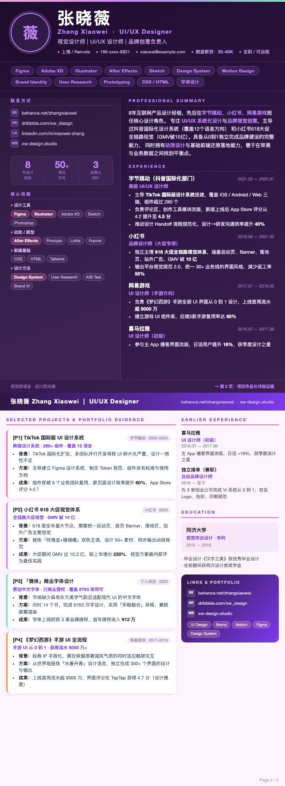
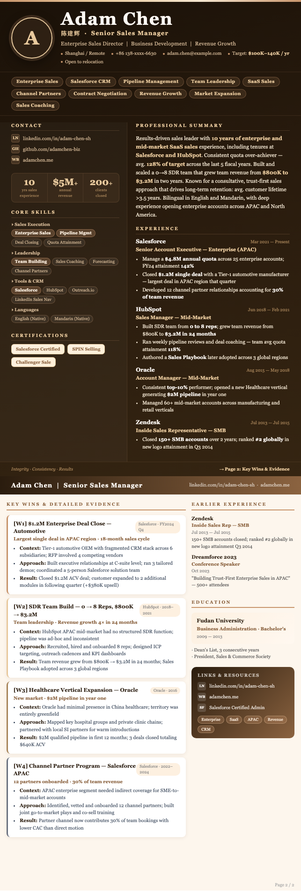

# 🎨 Resume Visual Skill

**A conversation-driven skill for Claude that transforms raw resume materials into stunning, print-perfect HTML resumes.**

Built from a real production session. Proven in actual job applications.

---

## ✨ What It Does

1. **Runs a structured intake conversation** — collects resume content, photos, links, art direction
2. **Extracts & rewrites content** — recruiter-optimized bullets, quantified achievements
3. **Generates a high-end HTML resume** — self-contained, all images base64-inlined
4. **Guides FireShot export** — best-quality PDF output via Chrome extension

### Example Output

#### 🌸 张晓薇 — UI/UX Designer · Macaron Palette



#### 🪵 Adam Chen — Sales Manager · Japanese Home Palette



---

## 🗂 Structure

```
resume-visual-skill/
├── SKILL.md                               # Main skill — triggers + workflow
├── references/
│   ├── conversation-flow.md               # Intake dialogue script
│   ├── design-system.md                   # CSS tokens, 5 color presets, layout specs
│   └── html-template.md                   # Annotated base HTML structure
└── examples/
    ├── alex-resume-case.md                # Production case study (anonymized)
    ├── zhang-xiaowei-designer-resume.html # Demo: Designer · Macaron palette
    ├── adam-chen-sales-resume.html        # Demo: Sales · Japanese home palette
    ├── zhang-resume-preview.png           # Screenshot — 张晓薇
    └── adam-resume-preview.png            # Screenshot — Adam Chen
```

---

## 🎨 Design Presets

| Preset | Style | Use Case |
|--------|-------|----------|
| **Dark Tech Blue** ⭐ | Deep blue gradient, cyan accents | Tech / AI / Engineering |
| **Midnight Black** | Pure black, silver accents | Senior / executive |
| **Clean Minimal** | White + blue, airy | Product / design / finance |
| **Warm Editorial** | Brown + orange, magazine-feel | Creative / education |
| **Bold Red** | High-contrast red-black | Startup / sales |
| **Macaron** 🌸 | Mauve + rose + lavender + mint | Design / creative / art |
| **Japanese Home** 🪵 | Warm wood + sand + terracotta | Sales / consulting / BD |

Users can also upload a reference image or describe their style in words.

---

## 📤 Recommended Export: FireShot

The HTML file is the primary deliverable. Export to PDF with:

1. Open HTML in **Chrome**
2. Install **[FireShot](https://chrome.google.com/webstore/detail/take-webpage-screenshots/mcbpblocgmgfnpjjppndjkmgjaogfceg)** (free extension)
3. Click FireShot → **"Capture Entire Page"** → **"Save as PDF"**

This preserves all gradients, shadows, and colors perfectly.

> **Why not just print?** Chrome's built-in print/PDF often strips background colors.
> FireShot captures the page exactly as rendered.

---

## 🚀 Usage

### Install as a Claude Skill

Place this folder in your Claude skills directory. Claude will automatically detect it when you say anything like:

- *"帮我做一份好看的简历"*
- *"Design a beautiful resume for me"*
- *"I want to visually upgrade my CV"*
- *"Turn my resume into HTML"*

### What the Conversation Looks Like

```
User: 帮我设计一份简历

Claude: 我来帮你打造一份高端视觉简历！在开始设计之前，我需要了解你的情况。
        首先，请提供你的简历内容...

[User provides PDF / text / links]

Claude: 收到！请告诉我你的在线主页...
        这份简历主要投递什么方向？
        请上传一张头像照...
        最后，选择风格：Dark Tech Blue / Midnight Black / ...

[After all materials collected]

Claude: 好的，开始生成！
        [Markdown preview]
        [HTML file output]
        📤 FireShot 导出指引...
```

---

## 🔧 Technical Stack

- **HTML + inline CSS** — single self-contained file
- **PIL/Pillow** — image resizing + base64 encoding
- **pdftotext** — PDF content extraction
- **wkhtmltopdf** — optional PDF generation
- **pypdf** — PDF page cropping (trim right blank, unify height)
- **Python** — image processing scripts

---

## 📋 Requirements

- Claude with computer use / bash tool access
- Python 3 + Pillow (`pip install Pillow`)
- Optional: `pdftotext` (poppler-utils), `wkhtmltopdf`, `pypdf`

---

## 📖 Case Study

See [`examples/alex-resume-case.md`](examples/alex-resume-case.md) for the full production walkthrough:

- AI Agent Engineer resume, 14 years experience
- Dark Tech Blue style, 2-page layout
- Avatar: coffee shop working photo
- Iterative refinement (3 rounds)
- Final export via FireShot

---

## 📄 License

MIT — use freely, attribution appreciated.

---

*Built during a real resume design session. The best resume tool is one that actually gets used.*
